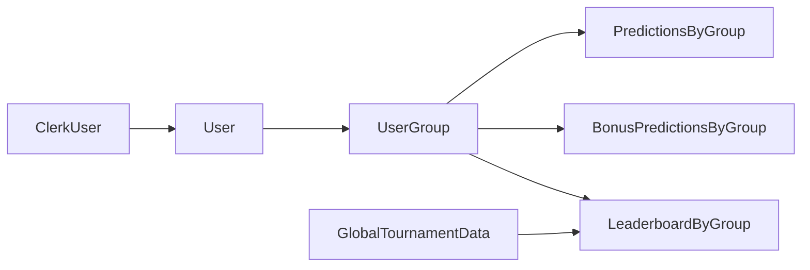

# Plan para multitenancy por grupos

## Recomendación

Propongo modelar el multitenant como `grupos` de quiniela, no como torneos independientes. El catálogo base del Mundial sigue siendo global (`teams`, `players`, `matches`, resultados reales), y lo que pasa a ser tenant-scoped es la participación: grupo del usuario, roles, predicciones, bonus, leaderboard, exports y vistas administrativas.

El alta de grupos no ocurre desde la UI: los grupos se crean manualmente en Convex y el usuario solo puede completar su registro uniéndose con un código válido. Ese código será fijo y manual por grupo, no autogenerado ni descartable.

Esto encaja bien con cómo está armada la app hoy, porque el problema actual no es la autenticación sino que varias piezas asumen un singleton global:

- [`convex/schema.ts`](../convex/schema.ts)
- [`convex/users.ts`](../convex/users.ts)
- [`convex/predictions.ts`](../convex/predictions.ts)
- [`convex/tournamentSettings.ts`](../convex/tournamentSettings.ts)
- [`convex/scoring.ts`](../convex/scoring.ts)

## Modelo objetivo



### 1. Separar identidad global de participación por grupo

Mantener `users` como identidad global sincronizada desde Clerk, pero asociar cada usuario a un único grupo y mover fuera de ahí todo lo que hoy es global y en realidad debería depender del grupo.

Cambios propuestos:

- Crear `groups`: `name`, `slug`, `status`, `inviteCode` fijo/manual y metadata administrativa mínima.
- Agregar `groupId` a `users` para representar la pertenencia única.
- Reemplazar `users.isAdmin` global por un rol asociado al grupo del usuario.
- Dejar `users.score` como dato derivado del grupo; idealmente removerlo del usuario global y calcularlo al vuelo o guardarlo en una tabla específica del grupo si hace falta optimizar.

Flujo de registro propuesto:

- El usuario crea sesión con Clerk.
- `users.store` sincroniza la identidad, pero el usuario puede quedar inicialmente con `groupId: undefined`.
- Si el usuario no tiene grupo asignado, la app lo redirige a una pantalla de onboarding para `unirse con código`.
- Esa pantalla valida el `inviteCode`, resuelve el grupo y persiste `users.groupId`.
- La creación de grupos y la carga de su `inviteCode` quedan fuera del flujo público y se hacen manualmente en Convex.

Archivos más impactados:

- [`convex/schema.ts`](../convex/schema.ts)
- [`convex/users.ts`](../convex/users.ts)
- [`src/components/SyncUser.tsx`](../src/components/SyncUser.tsx)

### 2. Scopear predicciones y bonus por grupo

Como cada usuario pertenece a un solo grupo, `predictions` y `bonusPredictions` pueden seguir ancladas a `userId`, pero el aislamiento de tenant debe quedar garantizado a través del grupo del usuario y de validaciones de consistencia.

Cambios propuestos:

- Mantener `userId` como relación principal en `predictions` y `bonusPredictions`.
- Usar `users.groupId` como fuente de verdad del tenant para leaderboard, export y permisos.
- Evaluar si conviene duplicar `groupId` en `predictions` y `bonusPredictions` solo para simplificar índices, consultas y validaciones; no es obligatorio en este modelo.

Snippets relevantes del diseño actual:

```1:16:convex/schema.ts
users: defineTable({
  name: v.string(),
  email: v.string(),
  image: v.optional(v.string()),
  displayName: v.optional(v.string()),
  score: v.number(),
  clerkId: v.optional(v.string()),
  isAdmin: v.optional(v.boolean()),
})
  .index("by_clerkId", ["clerkId"])
  .index("by_score", ["score"]),
```

```59:73:convex/schema.ts
predictions: defineTable({
  userId: v.id("users"),
  matchId: v.id("matches"),
  homeScore: v.number(),
  awayScore: v.number(),
})
  .index("by_user_match", ["userId", "matchId"])
  .index("by_matchId", ["matchId"]),

bonusPredictions: defineTable({
  userId: v.id("users"),
  topScorer: v.optional(v.id("players")),
  mostGoalsTeam: v.optional(v.id("teams")),
  leastConcededTeam: v.optional(v.id("teams")),
}).index("by_userId", ["userId"]),
```

Objetivo nuevo:

- `predictions`: mantener unicidad lógica por `(userId, matchId)`.
- `bonusPredictions`: mantener unicidad lógica por `(userId)`.
- Todas las queries/mutations deben resolver el grupo desde el usuario autenticado y rechazar accesos cruzados entre usuarios de grupos distintos.

Archivos más impactados:

- [`convex/predictions.ts`](../convex/predictions.ts)
- [`convex/bonusPredictions.ts`](../convex/bonusPredictions.ts)
- [`src/app/predictions/page.tsx`](../src/app/predictions/page.tsx)

### 3. Dividir settings globales vs settings por grupo

Hoy `tournamentSettings` mezcla varias responsabilidades y además se lee como singleton con `.first()`:

```36:57:convex/tournamentSettings.ts
export const get = query({
  args: {},
  handler: async (ctx) => {
    const settings = await ctx.db.query("tournamentSettings").first();
    return (
      settings ?? {
        predictionsLocked: false,
        lockedAt: undefined,
        updatedBy: undefined,
        actualTopScorers: undefined,
        actualMostGoalsTeams: undefined,
        actualLeastConcededTeams: undefined,
```

Para multitenancy conviene separarlo en dos capas:

- `globalTournamentSettings`: resultados reales, top scorers reales, equipos con más/menos goles recibidos, y cualquier dato que pertenece al torneo compartido.
- `groupSettings`: lock de predicciones, export actual, metadata de administración y cualquier configuración propia del grupo.

Esto evita que una acción administrativa en un grupo afecte a todos.

Archivos más impactados:

- [`convex/tournamentSettings.ts`](../convex/tournamentSettings.ts)
- [`convex/scoring.ts`](../convex/scoring.ts)
- [`convex/predictionsExport.ts`](../convex/predictionsExport.ts)
- [`src/app/api/predictions/export/route.ts`](../src/app/api/predictions/export/route.ts)

### 4. Introducir contexto de grupo activo en backend y frontend

Como cada usuario pertenece a un solo grupo, no hace falta un `activeGroup` explícito ni navegación multigrupo.

Recomendación de implementación:

- Resolver `groupId` directamente desde el usuario autenticado.
- Mostrar el nombre del grupo actual en la UI para dar contexto.
- Hacer que todas las queries y mutations sensibles validen que el usuario autenticado pertenece al grupo esperado y usen helpers como `requireGroupMember` y `requireGroupAdmin`.

Protección de rutas propuesta:

- Dejar pública una nueva `home` de marketing/bienvenida.
- Mantener `login` pública.
- Proteger todas las demás rutas de aplicación con Clerk.
- Si el usuario ya autenticado no tiene `groupId`, redirigirlo al onboarding de `unirse con código` antes de permitir acceso al resto de la app.

Esto simplifica bastante la arquitectura porque:

- evita selector de grupo y estado cliente adicional,
- reduce complejidad de rutas y middleware,
- hace más directo el control de permisos,
- simplifica testeo y debugging.

Archivos más impactados:

- [`src/components/LayoutClient.tsx`](../src/components/LayoutClient.tsx)
- [`src/middleware.ts`](../src/middleware.ts)
- [`src/app/page.tsx`](../src/app/page.tsx)
- [`src/app/login/page.tsx`](../src/app/login/page.tsx)
- [`src/app/predictions/page.tsx`](../src/app/predictions/page.tsx)
- [`src/app/profile/page.tsx`](../src/app/profile/page.tsx)
- [`src/app/admin/results/page.tsx`](../src/app/admin/results/page.tsx)

### 5. Reescribir permisos alrededor de membresías

Hoy el control de permisos depende de `users.isAdmin` y de comparar `userId`:

- [`convex/users.ts`](../convex/users.ts)
- [`convex/predictions.ts`](../convex/predictions.ts)
- [`convex/bonusPredictions.ts`](../convex/bonusPredictions.ts)

Para multitenancy, los helpers deberían pasar a este esquema:

- `getCurrentUser()` devuelve identidad global.
- `getCurrentGroup()` resuelve el grupo a partir de `users.groupId`.
- `requireGroupMember()` valida que el usuario tenga grupo asignado.
- `requireGroupAdmin()` valida funciones administrativas dentro de ese grupo.

Además, cualquier query que reciba `userId` debe verificar que emisor y target pertenezcan al mismo grupo antes de devolver datos.

### 6. Ajustar leaderboard, scoring y export a nivel grupo

El leaderboard actual agrega todos los usuarios y bonus del deployment:

```102:139:convex/users.ts
export const leaderboard = query({
  args: {},
  handler: async (ctx) => {
    const [users, settings, bonusPredictions] = await Promise.all([
      ctx.db.query("users").withIndex("by_score").order("desc").collect(),
      ctx.db.query("tournamentSettings").first(),
      ctx.db.query("bonusPredictions").collect(),
    ]);
```

Y el scoring recalcula para todo el mundo:

```89:141:convex/scoring.ts
export async function recalculateLeaderboardInMutation(ctx: MutationCtx) {
  const users = await ctx.db.query("users").collect();
  const matches = await ctx.db.query("matches").collect();
  const finishedMatches = matches.filter((m) => m.status === "finished");
  const predictions = await ctx.db.query("predictions").collect();
  const bonusPredictions = await ctx.db.query("bonusPredictions").collect();
```

Objetivo nuevo:

- leaderboard por `groupId`.
- scoring por grupo, usando el torneo global como input y las predicciones del grupo como universo.
- export por grupo, con archivo y token asociados al grupo activo.

### 7. Plan de migración sin romper producción

Como hoy la app es single-tenant, conviene migrar en fases:

- Crear un grupo por defecto que represente el estado actual.
- Asignar `groupId` a todos los usuarios existentes dentro de ese grupo.
- Marcar como admins del grupo a quienes hoy tienen `users.isAdmin`.
- Mantener `predictions` y `bonusPredictions` vinculadas a sus usuarios actuales y validar que todos apunten indirectamente al grupo por defecto.
- Migrar `tournamentSettings` a la nueva separación `global` + `group`.
- Recalcular leaderboard solo para el grupo por defecto y validar que coincida con el comportamiento actual.

## Orden recomendado de implementación

1. Cambiar esquema e índices en [`convex/schema.ts`](../convex/schema.ts).
2. Introducir tabla de grupos y helpers para resolver el grupo del usuario en Convex.
3. Migrar permisos y queries críticas (`users`, `predictions`, `bonusPredictions`).
4. Separar settings globales de settings por grupo.
5. Ajustar scoring y export.
6. Ajustar onboarding, middleware y UI para mostrar el grupo del usuario, permitir unión por código y eliminar supuestos globales.
7. Ejecutar migración del tenant actual a un grupo por defecto.

## Riesgos principales

- Dejar alguna query sin filtro por grupo y filtrar solo en frontend.
- Mantener `isAdmin` como flag global demasiado tiempo y mezclar permisos viejos con nuevos.
- Reusar `users.score` global cuando el score ahora debe variar por grupo.
- No separar correctamente `tournamentSettings`, lo que haría que bloquear o exportar en un grupo afecte a todos.
- Dejar rutas accesibles para usuarios autenticados sin grupo, saltándose el onboarding por código.
- Tratar el `inviteCode` como secreto fuerte cuando en realidad será un identificador manual fijo; conviene asumir que debe ser suficientemente difícil de adivinar.

## Decisiones cerradas

- Cada usuario pertenece a un único grupo.
- El torneo base (`teams`, `players`, `matches`, resultados) sigue siendo global.
- El alta a grupos desde UI no existe.
- Los grupos se crean manualmente en Convex.
- El ingreso a un grupo se hace solo con `inviteCode`.
- El `inviteCode` es fijo y manual por grupo.
- `home` y `login` son públicas.
- El resto de la app requiere autenticación y grupo asignado.

## Impacto en navegación y acceso

- `home` pasa a ser la única portada pública de la app junto con `login`.
- El resto de las páginas actuales deben considerarse parte del espacio autenticado.
- Hace falta una nueva pantalla de onboarding para `unirse con código`.
- El middleware deja de proteger solo algunas rutas y pasa a proteger todo excepto las rutas públicas explícitas.

## Resultado esperado

Al final, una misma instancia de la app podrá alojar múltiples quinielas aisladas entre sí, compartiendo el catálogo del torneo pero no sus participantes, predicciones, rankings ni administración.
